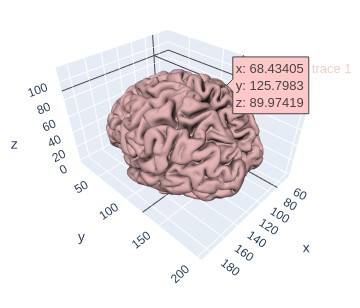

# Colorado

## Plot pyAims entities in Python Notebooks.

```{python}
import colorado as cld
meshR = aims.read('data/subject01_Rhemi.mesh')
meshL = aims.read('data/subject01_Lhemi.mesh')
cld.draw([meshL, meshR])
```



The `colorado` module is an interface between `aims` and `plotly`.

The functions implemented in this module allow to plot aims objects (buckets volumes and meshes) with plotly.
It can be used, for example, inside jupyter notebooks.

### Install
1. clone this repo

2. install the module:

```{bash}
$ cd colorado
$ pip install .
```
3. install node and npm (takes minutes). Run the `instal_node.sh` script:
```
$ ./install_node.sh
```
4. Install the plotly plug-in in [Jupyter notebook](https://plotly.com/python/getting-started/#jupyter-notebook-support) or [Jupyter-lab](https://plotly.com/python/getting-started/#jupyterlab-support) (instructions in the links).

### Resources
* [simple example](https://neurospin.github.io/colorado/tutorial/tutorial.html)
* [documentation](https://neurospin.github.io/colorado/build/html/colorado.html#module-colorado)
